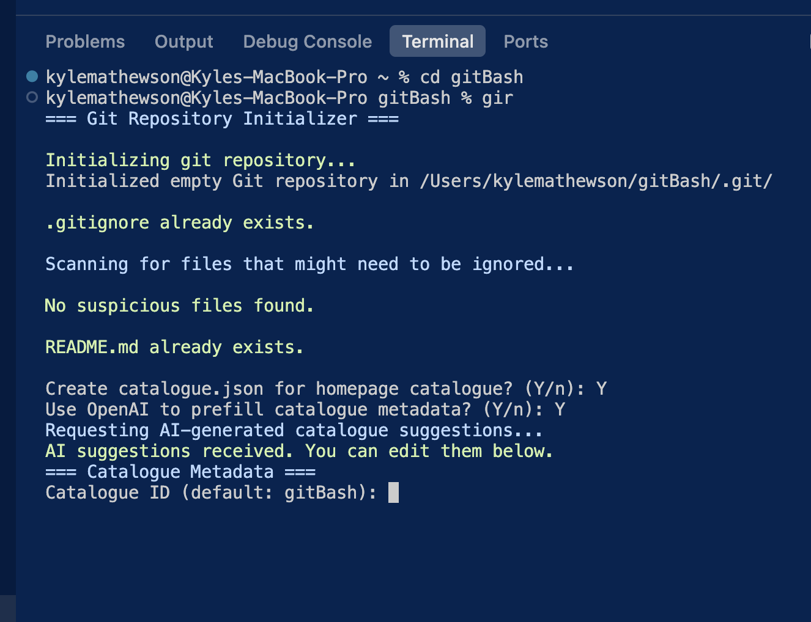

# gitBash - Git Repository Initializer

A convenient bash script to streamline git repository initialization with GitHub integration.

## Preview

<p align="center">
  
</p>

## Features

- 🚀 Initializes git repository with `git init`
- 📝 Creates or checks for `.gitignore` with sensible defaults
- 🔍 Scans for sensitive files (secrets, credentials, large files)
- 🤔 Asks user about each potentially sensitive file
- 📚 Creates README.md if missing
- 💾 Creates initial commit
- 🐙 Creates and pushes to GitHub repository using `gh` CLI
- 🌐 Optionally enables GitHub Pages with automatic URL link in README
- 🔗 Creates live demo at `username.github.io/repo-name`
- 🖼️ Auto-embeds `screenshot.png` (if present) into README with a centered preview
- 🗂️ Prompts for `catalogue.json` metadata so the homepage catalogue can index the repo
- 🤖 (Optional) Uses OpenAI to prefill `catalogue.json` fields when `OPENAI_API_KEY` is set
- ♻️ `gir -m` modify mode retrofits existing repos (README, .gitignore, Pages guidance)
- 🧹 Optional cleanup: delete local folder after pushing to GitHub

## Installation

The installation has already been completed! The script is located in `~/gitBash/` and configured in your `.zshrc`.

### What was installed:

1. **git-init-repo.sh** - Main script that handles repository initialization
2. **init.sh** - Configuration file sourced by your shell
3. **.zshrc** - Updated to load the gitBash scripts

## Usage

To use the script, navigate to any directory where you want to initialize a git repository and run:

```bash
git-init-repo
```

Or use the shorter alias:

```bash
gir
```

### Modify an Existing Repository

```bash
gir -m
```

`gir -m` is perfect after cloning an older project—you'll get the README template, `.gitignore`, screenshot embedding, GitHub Pages guidance, and optional push without re-running `git init`.

### What the script does:

1. Runs `git init` in the current directory
2. Creates a `.gitignore` file if one doesn't exist
3. Scans for:
   - Files with "secret", "password", "credentials" in the name
   - `.pem`, `.key`, `.env` files
   - `.yaml` and `.json` files
   - Large files (>10MB)
4. Asks you about each file found whether to ignore it or track it
5. Updates `.gitignore` accordingly
6. Creates a `README.md` if missing (asks for repo name and description)
7. Runs `git add .`
8. Runs `git commit -m 'init commit'`
9. Asks if repo should be public or private
10. Creates GitHub repository using `gh` CLI
11. Pushes the initial commit to GitHub
12. Asks if you want to enable GitHub Pages
13. If enabled, sets up GitHub Pages from the main branch
14. Adds a live demo link to your README (e.g., `https://username.github.io/repo-name`)
15. Commits and pushes the updated README
16. Detects `screenshot.png` (or .jpg/.jpeg variants) and adds a centered preview to README
17. Prompts you to create/update `catalogue.json` so the homepage catalogue can auto-ingest the repo (optionally prefilled via OpenAI when `OPENAI_API_KEY` is set)
18. In modify mode, optionally pushes your new commit to origin
19. In init mode, optionally deletes the local folder after everything is safely on GitHub

## Smart Project Type Detection

The script automatically detects your project type and provides intelligent suggestions:

### ✅ Static Sites (GitHub Pages compatible):
- **Detected:** Projects with `index.html` and no backend dependencies
- **Action:** Offers to enable GitHub Pages
- **Perfect for:** HTML/CSS/JS, React builds, portfolio sites

### ⚠️ Backend/Server Apps (NOT GitHub Pages compatible):
The script detects:
- Python backends (Flask, FastAPI, Gradio, Streamlit, Django)
- Node.js backends (Express, Koa, Fastify, NestJS)
- Apps in `requirements.txt` or `package.json`

**When detected, the script will:**
- Warn you that GitHub Pages won't work
- Detect if it's designed for local use (and suggest keeping it local)
- Suggest appropriate hosting alternatives:
  - **Render.com** - Free tier, easy Python/Node hosting
  - **Railway.app** - Free tier, simple deployment
  - **Hugging Face Spaces** - Free, perfect for Gradio/ML apps
  - **Vercel** - Great for Next.js and serverless
  - **Netlify** - Static sites and some serverless functions

The script suggests but doesn't implement these alternatives - you stay in control!

### Example Detection Scenarios:

**Scenario 1: Simple HTML Game**
```
Detecting project type...
✓ Detected: Static website (HTML/CSS/JS)
This project is perfect for GitHub Pages!
Do you want to enable GitHub Pages? (y/n):
```

**Scenario 2: Gradio AI App**
```
Detecting project type...
⚠️  Detected: Python backend app
GitHub Pages only works for static HTML/CSS/JS sites.
This project requires a server to run.

Note: This appears to be designed for LOCAL use only.
Consider if hosting it publicly is necessary/desired.

If you want to host this online, consider:
  • Render.com (free), Railway.app, or Hugging Face Spaces (for Gradio/ML apps)

Do you still want to try enabling GitHub Pages? (not recommended) (y/n):
```

## GitHub Pages Support

When you enable GitHub Pages for static sites, the script will:
- Configure GitHub Pages to serve from your main branch
- Create a live demo URL at `https://username.github.io/repo-name`
- Automatically add a "🚀 Live Demo" link at the top of your README
- Commit and push the updated README

## Screenshot Preview Support

If a `screenshot.png`, `screenshot.jpg`, or `screenshot.jpeg` exists in the project root, the script:
- Detects it automatically
- Adds a `## Preview` section to the README
- Embeds the image centered at 720 px width for a polished look
- Skips if the screenshot is already referenced (avoids duplicates)

## Homepage Catalogue Metadata

To power the cards on the `homePage` project, the script now manages `catalogue.json` following the guidance in `catalogue_metadata.md`:
- Prompts you (in both init and modify modes) to create or refresh `catalogue.json`
- Collects title, ID, one-liner, demo URL, screenshot path, kind, categories, tags, and status
- Auto-suggests sensible defaults (repo name, GitHub URL, detected screenshot path, etc.)
- Outputs valid JSON that the homepage workflow ingests automatically

### AI-Assisted Prefill (Optional)

If you set `OPENAI_API_KEY` (and optionally `OPENAI_MODEL`, default `gpt-4o-mini`), `gir` will:
- Offer to call OpenAI and read your README/index/automation notes
- Receive a draft `catalogue.json`
- Prefill every prompt with the AI’s suggestion so you can confirm/tweak
- If the API is unavailable or rate-limited (HTTP 429), `gir` automatically falls back to manual entry

Set up in your shell config:
```bash
export OPENAI_API_KEY="sk-..."
# Optional: export OPENAI_MODEL="gpt-4o-mini"
```

You can always skip or re-run `gir -m` later if you need to update the catalogue entry.

## Modify Mode (-m)

Use `gir -m` inside an existing repository to retrofit all the niceties:
- Keeps the current `.git` history—no re-initialization
- Regenerates `.gitignore`, README scaffold, screenshot previews, and sensitive-file scans
- Provides the same GitHub Pages intelligence/warnings without creating a new repo
- Lets you enter a fresh commit message (defaults to `chore: repo retrofit`)
- Prompts to push the new commit to origin when finished

Perfect for older projects you wish had the new automation—just clone, run `gir -m`, and follow the prompts.

**Note:** GitHub Pages requires a public repository, or a GitHub Pro/Team/Enterprise account for private repos.

## Cleanup Option

After successfully pushing to GitHub (init mode only), the script asks if you want to delete the local folder to keep your computer clean.

**Safety features:**
- Shows exactly what will be deleted
- Requires typing 'DELETE' to confirm (prevents accidental deletion)
- Navigates to parent directory before deleting
- Displays your new location after cleanup

**Use case:** Perfect when you're initializing a project just to get it on GitHub and don't need a local copy, or when you want to clone it fresh later.

## Prerequisites

- Git installed on your system
- [GitHub CLI (gh)](https://cli.github.com/) installed and authenticated
  - Install: `brew install gh`
  - Login: `gh auth login`
- Optional: `OPENAI_API_KEY` environment variable (and `python3`) to enable AI-assisted catalogue prefill

## Activating in New Terminal Sessions

The script is automatically available in new terminal sessions since it's configured in `.zshrc`.

If you want to use it in your current terminal session without restarting, run:

```bash
source ~/.zshrc
```

## Example Workflow

```bash
# Create a new project directory
mkdir my-new-project
cd my-new-project

# Initialize with git and GitHub
git-init-repo
```

The script will guide you through the process with interactive prompts!

## Customization

You can edit the scripts:
- `~/gitBash/git-init-repo.sh` - Main script logic
- `~/gitBash/init.sh` - Aliases and PATH configuration

After editing, reload your shell configuration:
```bash
source ~/.zshrc
```

## Troubleshooting

**Command not found**: Make sure you've sourced your `.zshrc`:
```bash
source ~/.zshrc
```

**gh authentication error**: Make sure GitHub CLI is authenticated:
```bash
gh auth status
gh auth login  # if not authenticated
```

**Permission denied**: Make sure the script is executable:
```bash
chmod +x ~/gitBash/git-init-repo.sh
```

